通过学习 [用 iframe 和 worker 实现简易双线程通信](https://juejin.cn/post/7366459005882548250) 已经了解了小程序的双线程通信的原理

现在来实现一个简易的小程序框架，用来模拟微信小程序的运行机制

在实现小程序框架之前，我们需要模拟一个手机设备，然后在这个设备上运行微信应用

## 模拟手机设备

我们需要在浏览器上模拟一个手机设备，这个设备有一个 `app` 容器节点，用来挂载微信应用

这个事情交给 `Device` 类来完成，它的结构如下：

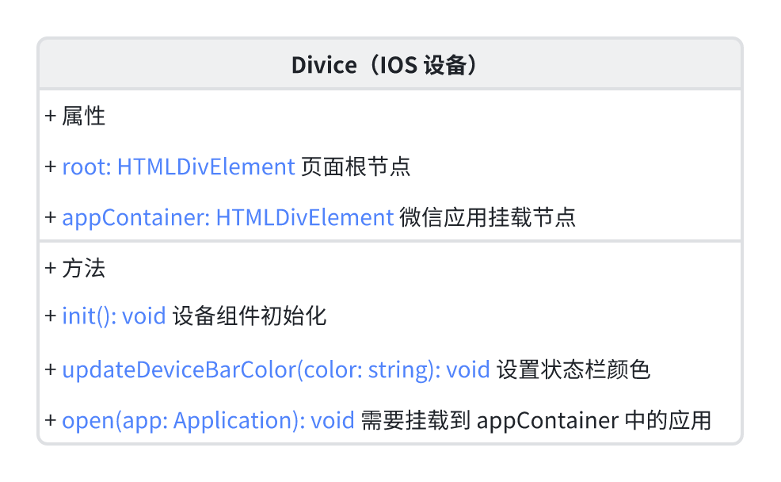

1. `init` 是初始化方法，用于初始化 `Device` 信息
2. `updateDeviceBarColor` 是用来设置状态栏颜色的函数
   - 状态栏目前支持 `black` 和 `white`
   - 如果在深色背景下，需要将状态栏设置为 `white`
   - 如果在浅色背景下，需要将状态栏设置为 `black`
3. `open` 方法是用来将应用挂载到 `app` 容器节点，也就是 `appContainer`

## 微信应用

手机设备准备好之后，就需要准备微信应用，这里我们只有准备两个页面：

- 发现页面：`Home`
- 小程序列表页面：`MiniAppList`

通过发现页的小程序进入小程序列表，然后点击某个小程序加载对应的小程序

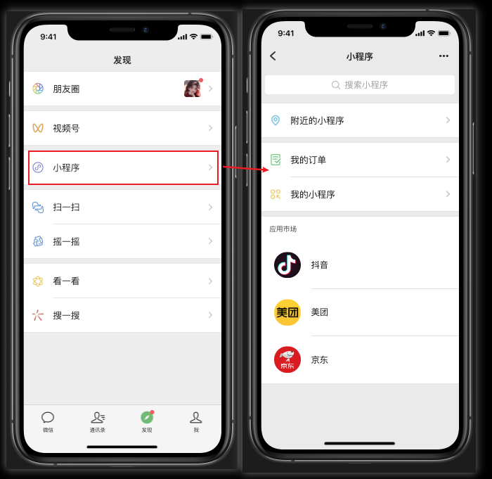

要实现这样的逻辑，我们需要准备 `3` 类：

- `Application`：用来承载微信应用
- `Home`：发现页面
- `MiniAppList`：小程序列表页面

这 `3` 个类的结构如下：

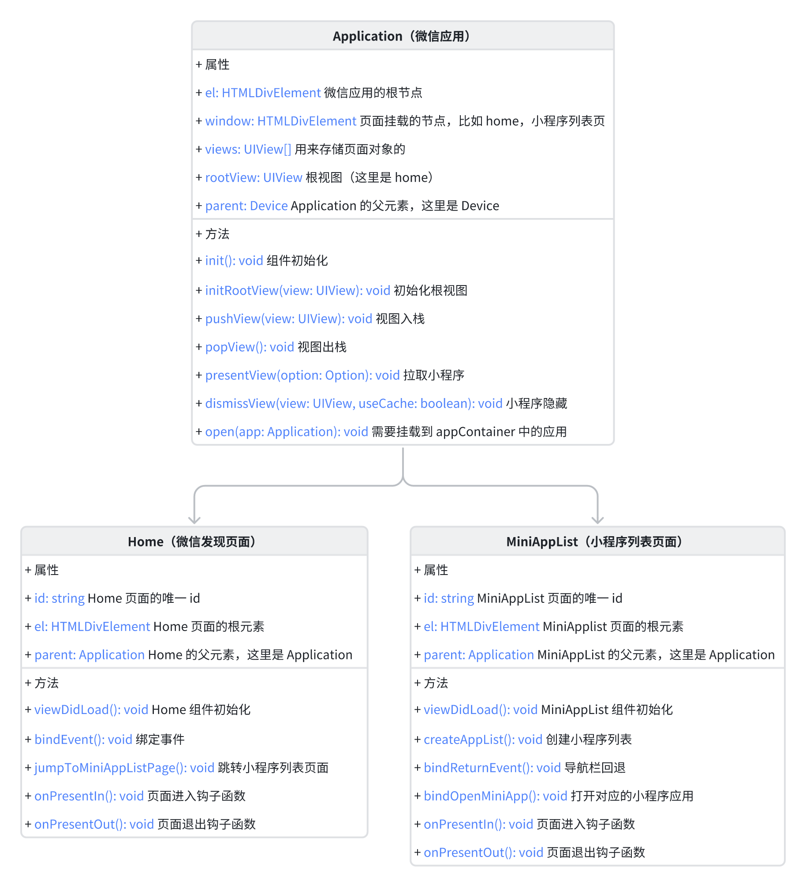

`Home` 类：

- `bindEvent` 用来绑定点击事件
- `jumpToMiniAppListPage` 点击事件触发时调用，跳转到小程序列表页面

`MiniAppList` 类：

- `createAppList` 用来创建小程序列表
- `bindReturnEvent` 点击左上角返回按钮时调用，返回到发现页面
- `bindOpenMiniApp` 点击小程序时调用，打开对应的小程序

`Home` 和 `MiniAppList` 两个页面都有三个钩子函数

- `viewDidLoad`：页面初始化时触发
- `onPresentIn`：页面进入视图时触发
- `onPresentOut`：页面离开视图时触发

他们的操作时序如下：

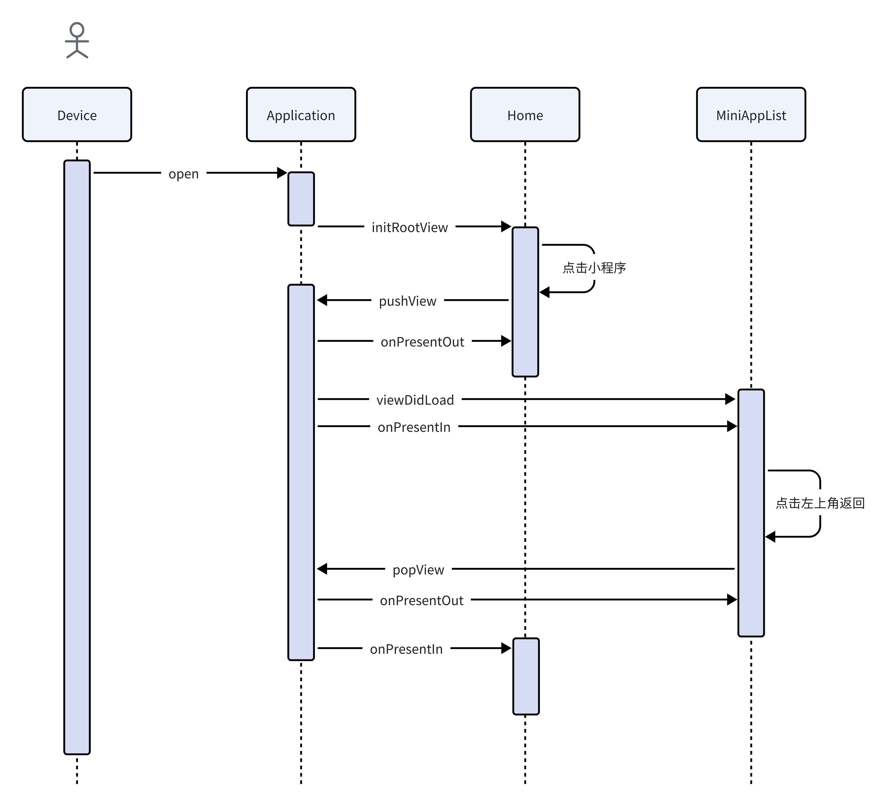

## 小程序初始化

当我们打开小程序时，会从底部拉起一个视图，然后在这个视图内加载小程序

这个视图就是小程序的容器，微信给每个小程序单独分配一个这样的容器，单独加载一个应用

所以小程序的初始化可以分为两个部分：

- 容器的初始化
- 应用的初始化

### 容器的初始化

容器初始化，我们需要创建两个类：

- `MiniAppSandbox`：小程序容器
  - 加载小程序应用
- `AppManager`：容器管理
  - 作用是用来调度小程序，比如说打开一个小程序或者关闭一个小程序

结构如下：

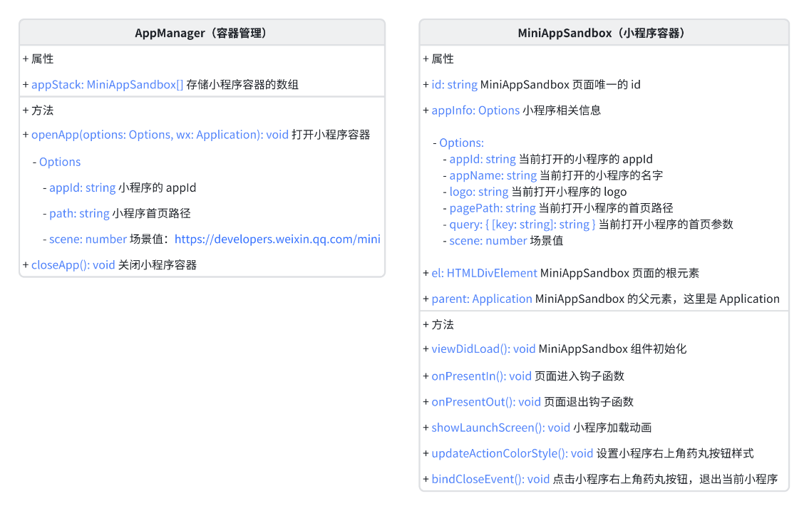

`MiniAppSandbox` 类：

- `openApp`：当前小程序列表中某个小程序被点击时调用，打开对应的小程序容器
- `closeApp`：当小程序右上角药丸按钮点击时调用，关闭当前小程序容器

`AppManager` 类：

- `showLaunchScreen`：小程序容器启动时，需要显示一个启动画面
- `updateActionColorStyle`：更新小程序右上角药丸按钮的颜色
- `bindCloseEvent`：点击小程序右上角药丸按钮时调用，关闭当前小程序容器

时序如下：

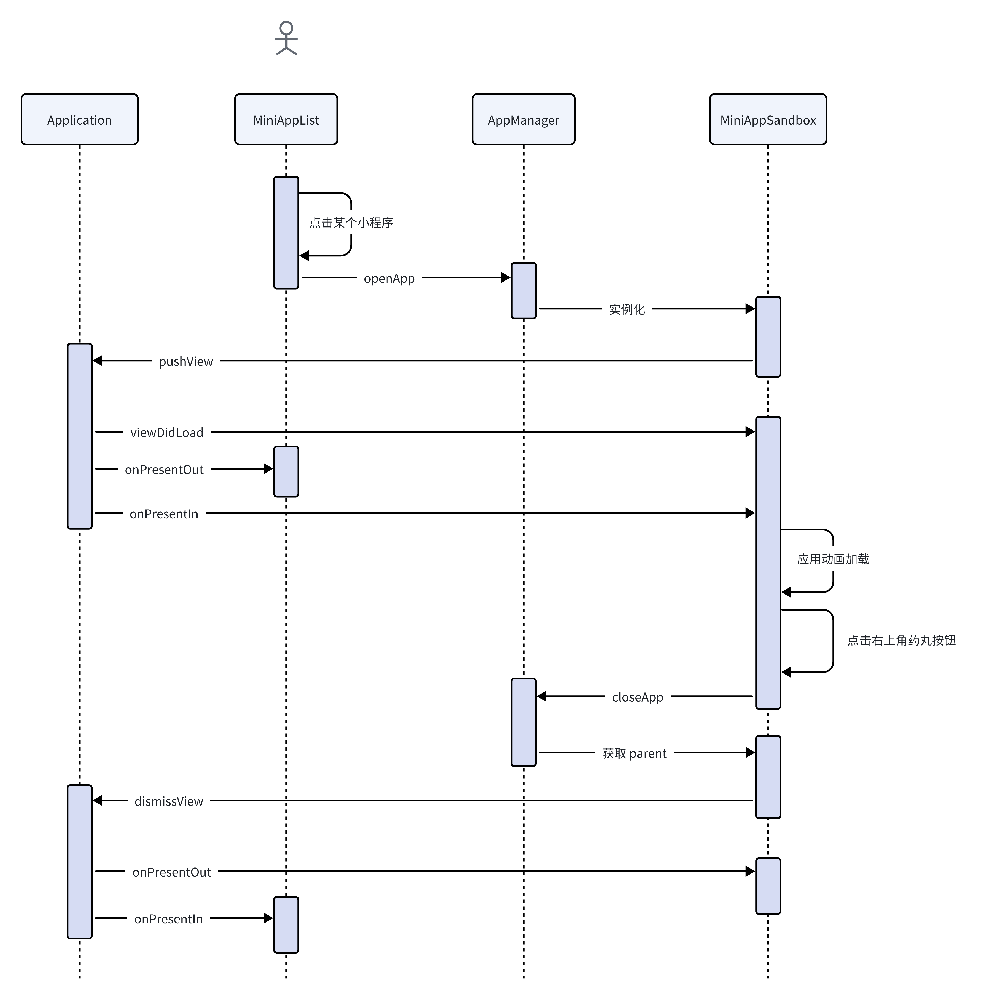

### 应用初始化

当我们在小程序列表页面点击某个小程序时，微信会去开放平台拉取这个小程序的相关信息，先进行容器的初始化，容器初始化完成之后会在页面渲染一个 `loading` 动画

在 `loading` 动画进行时，小程序会进行应用的初始化，应用初始化完成之后，会将 `loading` 动画替换为小程序的内容

这个小程序的信息就是我们平时开发的小程序，打包后的内容

应用初始化需要完成两件事情：

1. 读取小程序配置文件：[全局配置](https://developers.weixin.qq.com/miniprogram/dev/reference/configuration/app.html) 和 [页面配置](https://developers.weixin.qq.com/miniprogram/dev/reference/configuration/page.html)
2. 创建一个逻辑线程挂载到小程序容器上
   1. 每个小程序都有一个独立的逻辑线程
   2. 一个小程序共用一个逻辑线程

小程序应用初始化的需要完成 `6` 件事情：

1. 拉取小程序的资源
2. 读取小程序的配置文件
3. 设置状态栏的颜色
4. 创建通信桥 `bridge`
5. 触发应用的初始化逻辑
6. 隐藏启动动画

#### 拉取小程序资源

实际的微信小程序它是会去开放平台拉取小程序的资源，这里我们只是模拟，直接把打包好的小程序放到 `apps` 目录下

我们直接去 `apps` 目录下读取小程序的资源

#### 读取小程序配置文件

小程序打包时会页面所有的配置文件和全局配置文件统一放到一个 `json` 文件中

- 全局配置文件会放到 `app` 字段中
- 页面配置文件会放到 `modules` 字段中
  - 页面路径作为 `key`

```json
{
  "app": {
    "entryPagePath": "pages/home/index",
    "pages": ["pages/home/index", "pages/detail/index"],
    "window": {
      "navigationBarBackgroundColor": "#fff",
      "navigationStyle": "custom2",
      "backgroundColor": "#000000"
    },
    "networkTimeout": {},
    "debug": true
  },
  "modules": {
    "pages/home/index": {
      "navigationBarBackgroundColor": "#ddd",
      "navigationBarTextStyle": "white",
      "navigationBarTitleText": "首页",
      "backgroundColor": "#fff",
      "usingComponents": {}
    },
    "pages/detail/index": {
      "backgroundColor": "#fff",
      "usingComponents": {}
    }
  }
}
```

#### 设置状态栏的颜色

在小程序的官方文档中状态栏的颜色可以全局设置，也可以单独设置

所以我们在读取小程序配置文件时，需要将页面的配置信息和全局的配置信息进行一个合并，如果页面的 `page.json` 中有设置，就使用页面的设置，否则使用全局的设置

```js
mergePageConfig(this.appConfig.app, pageConfig);
```

合并完配置信息后，就可以根据当前页面的配置信息设置状态栏的颜色

#### 创建通信桥 bridge

小程序容器初始化后，就要为小程序分配一个逻辑线程和渲染线程

渲染线程和逻辑线程之间不能直接进行通信，它们需要通过主线程进行中转，这个主线程就是这里的通信桥 `bridge`

`bridge` 的结构如下：

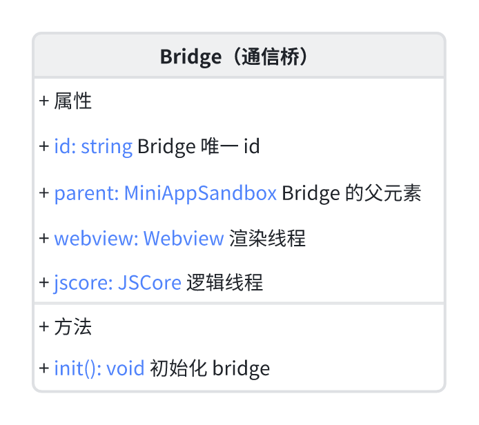

- `init` 方法是用来初始化 `bridge`

通信桥 `bridge` 创建完成之后就要创建逻辑线程和渲染线程了

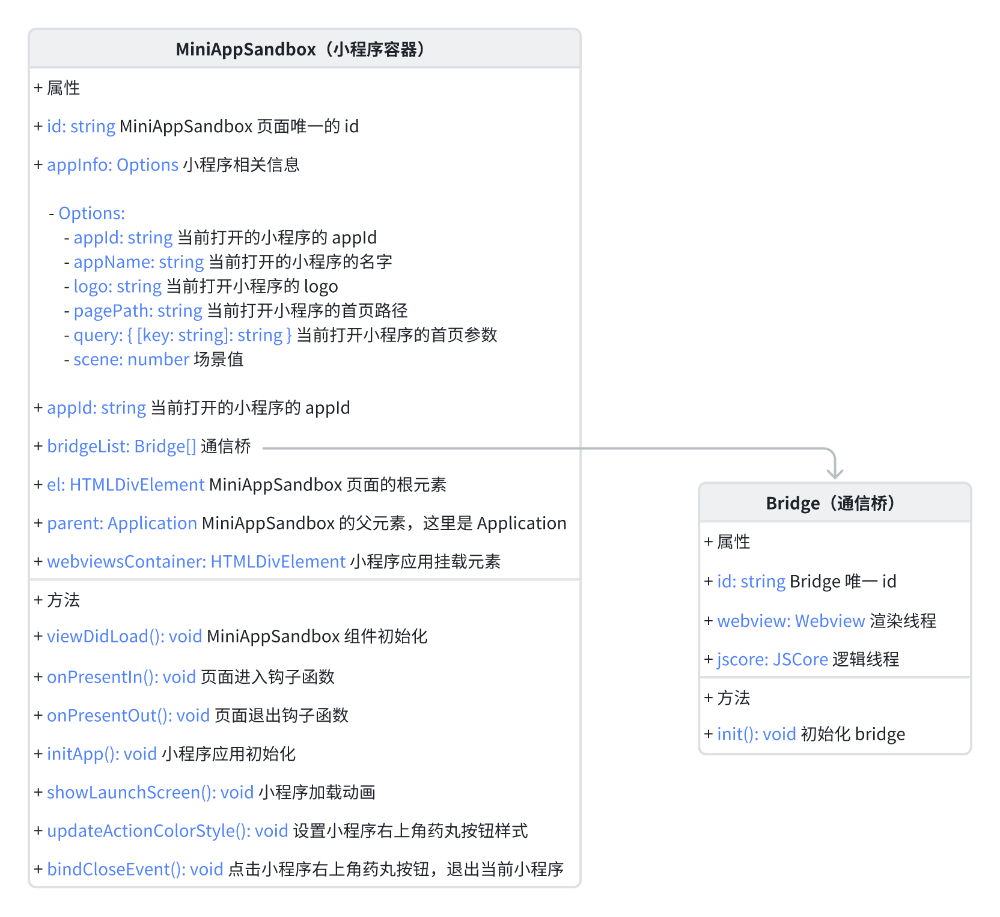

## 线程建设

不管是逻辑线程还是渲染线程，在线程建设的时候都分为两个步骤：

1. 线程初始化
2. 通信通道建设

### 逻辑线程初始化

逻辑线程初始化为每一个应用分配一个 `JSCore`，结构如下：

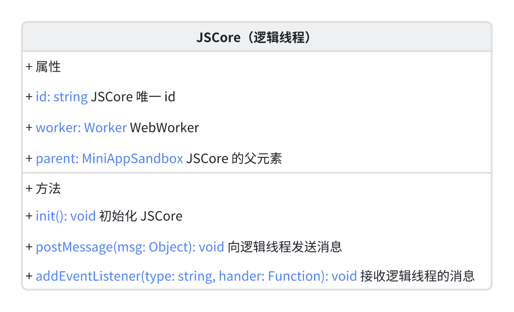

- `init` 方法是初始化 `JSCore`，用来加载一个 `js` 文件
  - 加载文件是一个异步过程
  - 这个 `js` 文件就是逻辑线程的 `SDK`
    - 在小程序中使用的 `wx`、`Page`、`App` 等方法都是在这个 `SDK` 中定义的

这个 `SDK` 我们是单独起一个 `Logic` 项目来完成，所有的信息都在这个 `SDK` 中定义

`JSCore` 使用 `Worker` 来加载这个 `SDK`，因为 `Worker` 是一个独立的线程，不会阻塞主线程

下面代码是 `JSCore` 的初始化代码：

- 由于 `Worker` 有同源策略，不能直接加载 `Logic` 中的文件
- 需要通过 `fetch` 读取到 `SDK` 的文件内容，染红通过 `Blob` 和 `URL.createObjectURL` 来加载
- 将 `Blob` 对象的 `URL` 传递给 `Worker` 来加载

```js
async init() {
  const jsContent = await fetch("http://127.0.0.1:3100/logic/core.js");
  const codeString = await jsContent.text();
  const jsBlob = new Blob([codeString], { type: "application/javascript" });
  const urlObj = window.URL.createObjectURL(jsBlob);
  this.worker = new Worker(urlObj);
}
```

### 逻辑线程通信建设

原生层需要向逻辑线程通信的话，调用 `jscore` 中 `web worker` 的 `postMessage`，将消息发送给 `SDK`

`SDK` 需要一个 `Message` 类来处理消息，同时，我们还需要一个 `MessageManager` 类，它的作用是监听 `Message` 中指定类型的消息，当 `Message` 类接收到指定类型的消息时，就会通知到 `MessageManager`，`MessageManager` 会调用对应的功能模块

`Message` 类的结构如下：

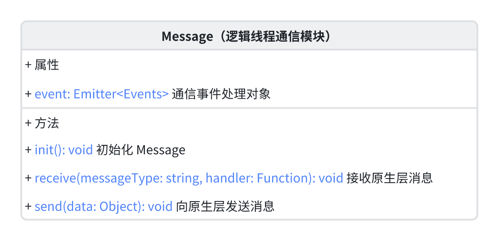

- `receive` 是用来监听原生层消息
- `send` 是用来向原生层发送消息

`MessageManager` 类的结构如下：

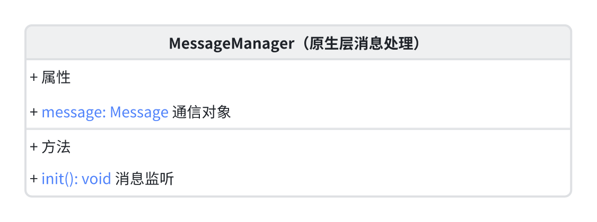

`Message` 和 `MessageManager` 之间的关系如下：

`MessageManager` 在 `SDK` 初始化时就会调用，在 `SDK` 初始化时需要监听来在原生成小消息，比如资源加载，监听的函数是调用 `Message` 中的 `receive` 方法，资源加载完了需要通知原生层，调用 `Message` 中的 `send` 方法

`SDK` 的通信建设完成后，原生层也需要进行通信建设

原生层的通信建设涉及到 `JSCore` 和 `Bridge`

`JSCore` 和 `Bridge` 之间的关系如下：

1. `Bridge` 调用 `JSCore.addEventListener` 注册一个 `message` 的消息，消息处理函数：`jscoreMessageHandler`
2. `JSCore` 在初始化时会注册一个 `SDK` 的消息
3. 当 `SDK` 发送消息被 `JSCore` 接收到时，`JSCore.addEventListener` 就会被触发，`Bridge.jscoreMessageHandler` 就会被调用

它们的工作时序如下：

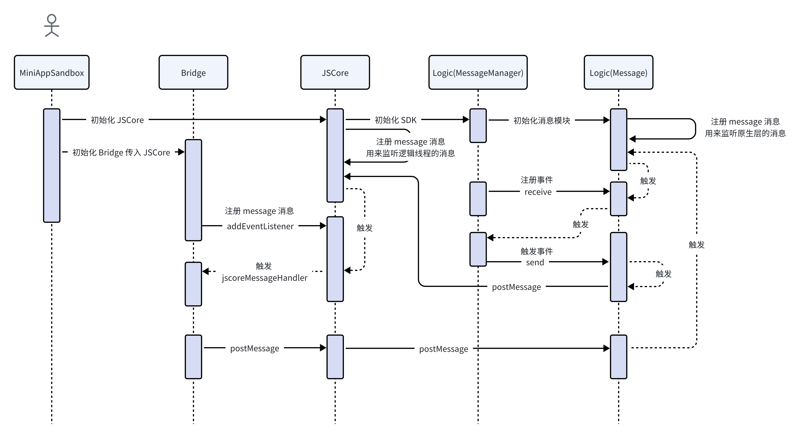

### 渲染线程初始化

渲染线程是用 `webview` 实现的，它是在 `Bridge` 初始化完成后，它的结构如下：

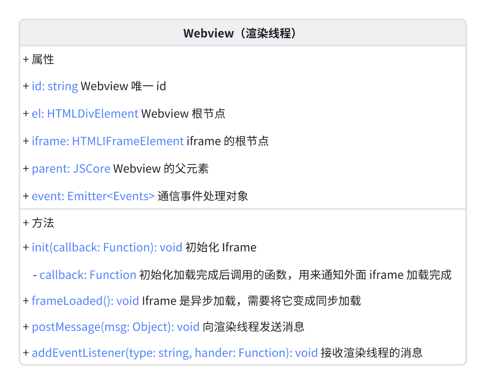

创建 `webview` 的代码如下：

- 实例化 `webview` 后，调用 `init` 方法初始化 `webview`
- 由于 `init` 方法是一个异步的过程，所以用 `Promise` 封装一下，让 `bridge` 能够拿到 `webview` 实例

```js
// bridge.js
createWebview() {
  return new Promise((resolve) => {
    const webview = new WebView({});
    webview.parent = this;
    webview.init(() => {
      resolve(webview);
    });
    this.parent.webviewsContainer.appendChild(webview.el);
  });
}
```

在 `Bridge` 中实例化 `Webview` 后，调用 `webview.init`，进入 `webview` 的初始化过程

1. 由于 `iframe` 是一个异步的过程，所以我们需要用 `Promise` 来封装 `iframe` 的初始化过程
2. 监听 `iframe` 的消息
   1. 在 `iframeWindow` 中监听注册一个 `onReceiveUIMessage` 方法
   2. 当 `iframe` 发送消息时，会调用 `onReceiveUIMessage` 方法，`webview` 就会收到消息

```js
// webview.js
async init(callback) {
  await this.frameLoaded();
  const iframeWindow = window.frames[this.iframe.name];
  iframeWindow.JSBridge.onReceiveUIMessage = (msg) => {
    this.event.emit("message", msg);
  };
  callback && callback();
}
```

### 渲染线程通信建设

渲染线程的通信通道建设和逻辑线程的通信通道建设类似，只是渲染线程是通过 `iframe` 和 `window.postMessage` 来实现的

渲染线程是用 `iframe` 实现的，用 `iframe` 加载 `uiSDK` 中的 `js` 文件，然后渲染页面，渲染线程和原生层交互是通过 `JSBridge` 来实现的

- 原生层调用 `onReceiveNativeMessage` 向 `iframe` 中发送消息
- 渲染线程调用 `onReceiveUIMessage`向原生层发送消息

所以渲染线程也需要 `Message` 和 `MessageManager`，`Message` 提供也提供 `receive` 和 `send` 两个方法

它们的时序如下：

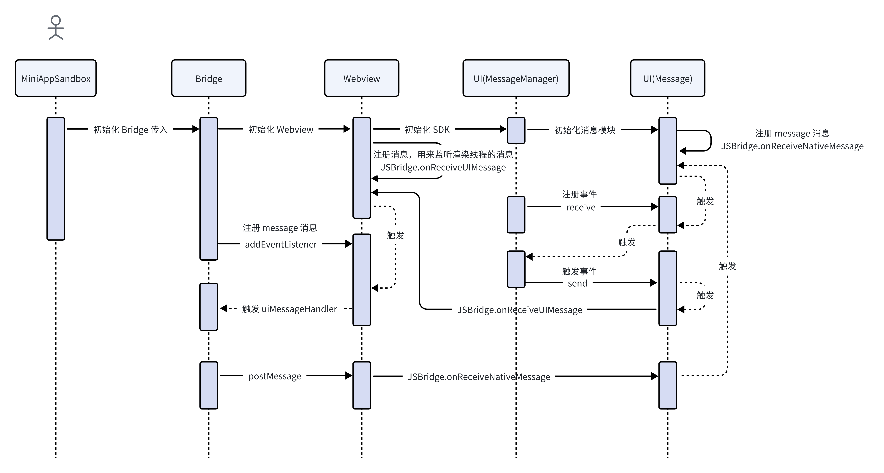

### 总结

他们完整的逻辑时序如下：

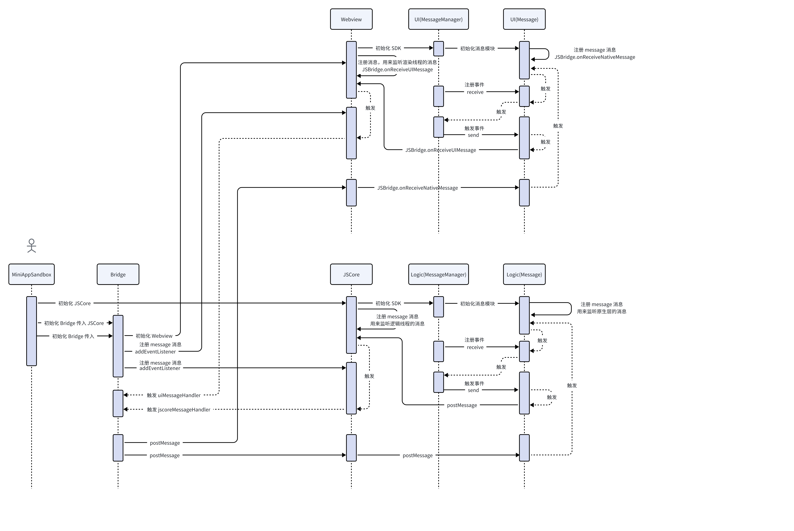
